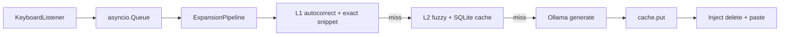

# Easify
Supercharge writing with llm-based text expansion anywhere you want to write, and for anything you want to write. clarification, spell check, unit conversion, emojis, now happens automatically.

Supercharge writing with LLM-based text expansion anywhere you type: clarification, spell-fix shortcuts, unit conversion, emoji, and semantic expansion — with **local Ollama**, **instant snippets**, **autocorrect**, and a **SQLite semantic cache**.

Type a trigger (default `///`), your intent, **Enter** → deterministic layers run first; if needed, **async** Ollama runs in the background → result is pasted when ready. Keyboard hooks stay **non-blocking** (you keep typing while Layer 3 runs).

## Architecture (multi-layer latency)

| Layer | Speed | Components |
|-------|--------|------------|
| **L1** | &lt;5 ms | `AutocorrectEngine` (token fixes on capture), `SnippetEngine` **exact** match |
| **L2** | ~1–10 ms | `SnippetEngine` **fuzzy** (`rapidfuzz`), `SqliteExpansionCache` (**O(1)** by key; tracks `hit_count` for “learning” signals) |
| **L3** | async / background | `OllamaClient` (`httpx`); results **cached** on success |

Pipeline: `app/engine/pipeline.py` — deterministic paths never call the network. Only L3 uses `httpx.AsyncClient` on a **dedicated event-loop thread** (`app/engine/service.py`). The **live word** path (`app/engine/live_word.py`) is cache/dictionary/snippet only — **no HTTP**. Injection (backspace + paste) is **serialized** behind `inject_busy` so pynput never recurse-loops.



## Repository layout

```text
easify/
  app/
    main.py           # CLI (run | init)
    config/           # Settings (env + paths)
    keyboard/         # pynput listener + key mapping
    engine/           # pipeline, ExpansionService, buffers
    ai/               # httpx Ollama client + prompt routing
    cache/            # SQLite store
    snippets/         # JSON + hot-reload + rapidfuzz
    autocorrect/      # dictionary JSON
    plugins/          # reserved registry (future)
    bundled/          # default *.json inside the wheel
    utils/            # logging, clipboard, metrics
  data/               # dev-time defaults (repo checkout)
  tests/
  requirements.txt
  pyproject.toml
```

## Install

```bash
git clone https://github.com/shreyas-shrestha/easify.git
cd easify
pip install .
# or: pip install git+https://github.com/shreyas-shrestha/easify.git

easify init    # optional: ~/.config/easify/snippets.json
easify         # or: python -m app
# from repo without install: python main.py
```

**macOS:** grant **Accessibility** and **Input Monitoring** to Terminal (or your IDE).

**Ollama:** `ollama serve` and e.g. `ollama pull phi3`.

## Environment

Prefer **`EASIFY_*`**. **`OLLAMA_EXPANDER_*`** still works where noted in `app/config/settings.py`.

### Config file (TOML)

Optional: **`~/.config/easify/config.toml`** or **`~/.easify/config.toml`**, or **`EASIFY_CONFIG=/path/to/config.toml`**. Keys mirror env names in snake_case (e.g. `live_autocorrect`, `cooldown_ms`, `model`). **Environment always wins** over the file for the same knob.

See `data/config.example.toml` in the repo.

| Variable | Meaning |
|----------|---------|
| `EASIFY_TRIGGER` | Prefix (default `///`) |
| `EASIFY_SNIPPETS` | Single snippets JSON path (overrides default path list) |
| `EASIFY_CACHE_DB` | SQLite cache file (default `~/.config/easify/cache.db`) |
| `EASIFY_CACHE_TTL_SEC` | If &gt; `0`, drop a cache row when `now - created_at` exceeds this (seconds). `0` = keep forever |
| `EASIFY_FUZZY_SCORE` | `rapidfuzz` cutoff **0–100** (default `82`) |
| `EASIFY_FUZZY_MAX_KEYS` | Max snippet keys scanned for fuzzy (default `5000`) |
| `EASIFY_VERBOSE` | `1` = log layer timings |
| `EASIFY_DEBUG` | `1` = keyboard capture log |
| `EASIFY_CLIPBOARD_RESTORE` | `1` = restore clipboard after paste |
| `EASIFY_RETRIES` | Ollama HTTP retries (default `2`) |
| `EASIFY_OLLAMA_TIMEOUT` | Total HTTP timeout seconds (default `120`) |
| `OLLAMA_URL` | Ollama generate URL |
| `OLLAMA_MODEL`, `EASIFY_MODEL` | Model name (`EASIFY_MODEL` wins if both set) |

Intent hints: `emoji happy`, `fix teh`, `convert 5 ft to meters` (see `app/ai/prompts.py`).

## Snippets & autocorrect

- **Snippets:** JSON object / `{ "snippets": { ... } }`. Defaults: `data/snippets.json`, `app/bundled/snippets.json`, then **`~/.config/easify/snippets.json`** (last wins on duplicate keys).
- **Autocorrect:** `data/autocorrect.json` or `~/.config/easify/autocorrect.json` with `{ "corrections": { "teh": "the", ... } }`. Applied to the captured phrase **before** snippet/LLM resolution.

## Live word buffer (SPACE-boundary)

**Philosophy:** deterministic first — **no AI on this path** (keeps latency predictable).

Opt-in: `EASIFY_LIVE_AUTOCORRECT=1`. While **idle** (not in `///`…`Enter` capture): each key goes to `LiveWordBuffer`; on **Space** or **Enter** the committed word runs `resolve_live_word()` in **`app/engine/live_word.py`** in this **exact order**:

1. `is_safe_word` (guards)  
2. Autocorrect dictionary — exact key (`word.lower()`)  
3. Snippet — exact key  
4. Snippet — fuzzy (`rapidfuzz.fuzz.ratio`), only if **score &gt; `EASIFY_LIVE_FUZZY_THRESHOLD`** (default 92)  
5. SQLite cache — `easify:live_word:v1` + token (written by **`///` AI**, optional **background enrich**, not on the hot path)  
6. No match → **no instant replace**; if `EASIFY_LIVE_CACHE_ENRICH=1`, Easify may **enqueue** an async Ollama job to fill that cache key (same event loop as `///`, rate-limited — typing never blocks on it)

**Guards** (reject word → no replace): `len(word) < EASIFY_LIVE_MIN_WORD_LEN` (default 3), entire token `isupper()`, leading capital, any digit, `_` `.` `/`, or `startswith("http")`. **Cooldown:** default **150 ms** between live replacements (`EASIFY_LIVE_COOLDOWN_MS`). Injection: delete **word + boundary space**, then **`replacement + space`** via `Controller.type` when possible; clipboard is fallback (`EASIFY_LIVE_CLIPBOARD_FALLBACK=1`).

**Listener:** `KEY` → if capture active, handle `///`; else feed live buffer; on Space, resolve + maybe replace.

With **`EASIFY_PHRASE_BUFFER_MAX` &gt; 0**, multi-word phrases use the same stages; async enrich can target the whole phrase when the buffer has two or more tokens.

| Variable | Default | Meaning |
|----------|---------|---------|
| `EASIFY_LIVE_AUTOCORRECT` | off | Enable live word engine |
| `EASIFY_LIVE_FUZZY` | on | Step 4 fuzzy snippets |
| `EASIFY_LIVE_CACHE` | on | Step 5 cache lookup |
| `EASIFY_LIVE_MIN_WORD_LEN` | `3` | Minimum length (reject shorter) |
| `EASIFY_LIVE_FUZZY_THRESHOLD` | `92` | Accept fuzzy match only if `ratio &gt;` this |
| `EASIFY_LIVE_COOLDOWN_MS` | `150` | Min ms between live replacements |
| `EASIFY_LIVE_CLIPBOARD_FALLBACK` | on | Use clipboard if `type()` fails |
| `EASIFY_TRIGGER` | `///` | Intent capture prefix |
| `EASIFY_MODEL` | `phi3` | Model id (alias for `OLLAMA_MODEL`; also used for cache keys) |
| `EASIFY_PREWARM` | off | Startup: reload corpora + touch warmup list in SQLite (no LLM) |
| `EASIFY_PHRASE_BUFFER_MAX` | `0` | Last *N* words for phrase correction (`0` = off); try phrase before single-word |
| `EASIFY_PERF` | off | Log per-stage timings (ms) for capture + live resolution |
| `EASIFY_INJECT_TYPE_FIRST` | on | `///` expansion: `Controller.type` before clipboard paste (better undo) |
| `EASIFY_METRICS` | off | `1` → persist counters under `~/.config/easify/metrics.json` (`live_replacements`, `capture_injections`, `live_enrich_*`) |
| `EASIFY_LIVE_CACHE_ENRICH` | off | After deterministic live miss, background Ollama → SQLite live-cache (`source=bg`) |
| `EASIFY_LIVE_ENRICH_MIN_LEN` | `4` | Min word length to enqueue single-token enrich |
| `EASIFY_LIVE_ENRICH_MAX_PER_MINUTE` | `12` | Soft cap on queued enrich jobs per rolling minute (`0` = unlimited) |
| `EASIFY_LIVE_ENRICH_MAX_CONCURRENT` | `2` | Max simultaneous Ollama calls for enrich |
| `EASIFY_LIVE_ENRICH_QUEUE_MAX` | `32` | `asyncio` queue size (drops when full) |
| `EASIFY_LIVE_ENRICH_SKIP_SAME` | on | If model returns the same text as input, do not `put` |
| `EASIFY_LIVE_FUZZY_CUTOFF` | — | **Deprecated:** maps to threshold ≈ cutoff−1 if set |
| `EASIFY_LIVE_FIX_COOLDOWN` | — | **Deprecated:** seconds → ms for cooldown if set |

## Roadmap (product)

- **Installer / auto-start:** LaunchAgent (macOS), systemd user unit (Linux), Task Scheduler (Windows).
- **GUI:** settings, cache stats, snippet editor.
- **Richer enrichment:** promotion of hot cache rows into snippets; embedding / semantic cache.

## Development

```bash
pip install -e ".[dev]"
pytest -q
```
