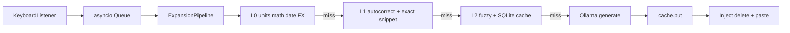

# Easify
Supercharge writing with llm-based text expansion anywhere you want to write, and for anything you want to write. clarification, spell check, unit conversion, emojis, now happens automatically.

Supercharge writing with LLM-based text expansion anywhere you type: clarification, spell-fix shortcuts, unit conversion, emoji, and semantic expansion — with **local Ollama**, **instant snippets**, **autocorrect**, and a **SQLite semantic cache**.

**Defaults:** live autocorrect, fuzzy, cache, phrase buffer (2 words), double-space capture, background live-cache enrich, prewarm startup, L3 rolling context (8 words), semantic snippets (needs `pip install easify[semantic]` or it logs and skips), accessibility inject try-first (`easify[accessibility]` + OS permission), and clipboard restore are **on**. Turn pieces off with `EASIFY_*` or `config.toml` if you want a leaner setup. **Not** on by default: expansion preview (confirm each result), debug/metrics noise.

Type a **trigger** (default `//`), then your intent, then **close with the same delimiter again** (default `//…//`)—**or press Enter** to submit. **Double-space** or a **palette hotkey** also open capture. Expansion runs **in the background**: you can keep typing after the closing delimiter; when the result is ready, Easify deletes exactly **capture + what you typed since**, inserts **result + that tail**, so flow is not blocked waiting on the LLM. **Live** autocorrect/fuzzy replace is paused while a capture is in flight so the tail buffer stays consistent. Set `EASIFY_CAPTURE_CLOSE=` empty for **Enter-only** submit (legacy). A **tray icon** shows idle / expanding / error.

## Architecture (multi-layer latency)

| Layer | Speed | Components |
|-------|--------|------------|
| **L0** | &lt;1 ms (local) / ~50–200 ms (FX fetch) | `l0_compute`: **pint** unit conversion, safe **AST** arithmetic, simple **date** phrases, **FX** via Frankfurter with **open.er-api.com** fallback if Frankfurter is slow/unreachable (cache in `~/.config/easify/fx_rates.json`) |
| **L1** | &lt;5 ms | `AutocorrectEngine` (token fixes on capture), `SnippetEngine` **exact** match |
| **L2** | ~1–10 ms | `SnippetEngine` **fuzzy** (`rapidfuzz`), `SqliteExpansionCache` (**WAL** + persistent connection; **O(1)** by key) |
| **L3** | async / background | `OllamaClient` (`httpx`); results **cached** on success |

Pipeline: `app/engine/pipeline.py` — L0 and the snippet/cache stack avoid Ollama when possible. **Currency** uses `httpx` only on rate cache miss. The **live word** path stays local except optional background enrich. Injection is **serialized** with a `threading.Lock` so concurrent capture + live-replace cannot interleave.



### Activation (Phase 1)

At least one must be enabled (defaults: **prefix on**, **double-space on**, palette off):

| Mode | Env | Notes |
|------|-----|--------|
| Prefix | `EASIFY_ACTIVATION_PREFIX=1` (default) | Requires `EASIFY_TRIGGER` (default `//`) and optional `EASIFY_CAPTURE_CLOSE` (default `//`) |
| Double-space | `EASIFY_ACTIVATION_DOUBLE_SPACE=1` (default) | Second **Space** within `EASIFY_DOUBLE_SPACE_WINDOW_MS` (default 400 ms) opens capture; two spaces are deleted |
| Palette | `EASIFY_PALETTE_HOTKEY='<ctrl>+<shift>+e>'` | pynput `GlobalHotKeys` grammar; opens a small **tkinter** window to type intent (no prefix) |

**Tray:** `EASIFY_TRAY=1` (default) — **pystray** + **Pillow**; Quit stops the listener. Disable with `EASIFY_TRAY=0` on headless servers.

**Injection target:** While you wait for L0/L3, macOS may focus **Terminal** (or another window). Easify records the frontmost app when you **finish** the capture and calls **Activate** right before inject (`EASIFY_PRE_INJECT_REFOCUS=1`, default). If Notes still ignores synthetic typing, try `EASIFY_INJECT_TYPE_FIRST=0` (clipboard paste). **Parallel tail:** after you keep typing while a capture resolves, Easify waits **`EASIFY_INJECT_SETTLE_MS`** (default 55 ms) after your last key before inject. It then **moves the caret left** across that tail, **deletes only** `//…//`, and types the **result** — your sentence is **not** backspaced away first (set `EASIFY_INJECT_TAIL_CURSOR_LEFT=0` to restore the legacy delete-through-tail behavior if an app mis-handles arrow keys).

**L0 examples:** `5 inches to cm`, `100 USD to EUR`, `2 + 2*3`, `today + 14 days`.

## Phase 2 (context, cloud LLM, preview, backends)

| Feature | Env / notes |
|---------|-------------|
| **Focused app → L3** | `EASIFY_CONTEXT_FOCUSED_APP=1` (default): macOS AppleScript, Windows title, Linux `xdotool` / `xprop` |
| **Rolling words** | `EASIFY_CONTEXT_BUFFER_WORDS=N` (default `8`): last *N* space-delimited tokens fed into the L3 system prompt |
| **AI provider** | `EASIFY_AI_PROVIDER=ollama` (default) \| `openai` \| `anthropic`; keys `OPENAI_API_KEY`, `ANTHROPIC_API_KEY`; models `EASIFY_OPENAI_MODEL`, `EASIFY_ANTHROPIC_MODEL` |
| **Expansion preview** | `EASIFY_EXPANSION_PREVIEW=1`: tkinter accept/cancel before inject |
| **Keyboard backend** | `EASIFY_BACKEND=pynput` (default) \| `keyboard` (optional `pip install easify[keyboard]`) \| `evdev` + `EASIFY_EVDEV_DEVICE=/dev/input/eventN` (`pip install easify[evdev]`, often requires permissions) |
| **Accessibility inject** | `EASIFY_INJECT_ACCESSIBILITY=1` (default) + `pip install easify[accessibility]` — find the last `//capture//` in the **focused** control’s string and replace it in one write (macOS `AXValue`, Windows `ValuePattern`). **No synthetic keys** on success. **Caret/selection** after `SetValue` is up to each app (not always preserved). Enable **Accessibility** for the process running Easify on macOS. If the substring is missing or the API fails, Easify **falls back** to the normal keystroke inject path. |

Cache keys for **contextual** L3 rows include the augmented system string (app + prior words). Snippet / fuzzy / context-free cache behavior is unchanged.

## Phase 3 (semantic snippets, promotion, namespaces, UI, undo)

| Feature | Env / notes |
|---------|-------------|
| **Semantic snippet match** | `EASIFY_SEMANTIC_SNIPPETS=1` (default) — embedding similarity on keys after fuzzy miss; install `easify[semantic]` (or `sentence-transformers`) or Easify logs and skips. `EASIFY_SEMANTIC_MODEL`, `EASIFY_SEMANTIC_MIN_SIMILARITY` (default `0.35`) |
| **Per-app snippet keys** | Keys `namespace:rest` (e.g. `slack:thanks`) only resolve when the **focused app** name contains `namespace`, unless `EASIFY_SNIPPET_NAMESPACE_LENIENT=1` (show all when focus is unknown) |
| **Cache → snippet promotion** | `EASIFY_CACHE_PROMOTE_MIN_HITS=N` (default `0` = off): after each cache hit, if `hit_count ≥ N` and source is in `EASIFY_CACHE_PROMOTE_SOURCES` (default `ai,bg`), append `promoted-<slug>` to `~/.config/easify/snippets.json` (deduped) |
| **Snippet web UI** | `easify ui` — `http://127.0.0.1:8765/` by default (`EASIFY_UI_HOST`, `EASIFY_UI_PORT`). **All** `/api/snippets` requests require header `X-Easify-Token` (set `EASIFY_UI_SECRET_TOKEN` or copy the token from the log line on startup) to reduce drive‑by CSRF from other browser tabs. |
| **Promotion cap** | `EASIFY_CACHE_PROMOTE_MAX_KEYS` (default `500`, `0` = unlimited) stops unbounded `promoted-*` growth |
| **Double-space timing** | `EASIFY_DOUBLE_SPACE_SETTLE_MS` (default `20`): brief pause after deleting the two spaces before capture mode so focused apps can process backspaces (pynput race mitigation) |
| **Live enrich** | Ultra-common words are skipped via `app/bundled/live_enrich_blocklist.txt` (no config knob) |
| **Undo last expansion** | `EASIFY_UNDO_HOTKEY='<ctrl>+<shift>+z>'` — removes the injected text and restores the captured trigger + intent when possible; palette expansions (`delete_count=0`) delete only the injected text |

## Doctor & autostart

| Command | Purpose |
|---------|---------|
| `easify doctor` | Prints **ok** / **warn** / **FAIL** for config paths, cache writability, and your AI backend. **`--json`** prints a full report + **`exit_code`** for CI/scripts. **`--strict`** exits with an error if anything warns. |
| **Startup L3 hints** | On `easify run`, a quick HTTP probe logs **warnings** if L3 is misconfigured. `EASIFY_STARTUP_HEALTH=0` disables it; `EASIFY_STARTUP_HEALTH_TIMEOUT` sets the timeout in seconds (default `3`, max `60`). `easify doctor` uses the same probe logic as startup (via `app/cli/l3_probe.py`). |
| `easify autostart install` | **macOS:** `~/Library/LaunchAgents/com.easify.app.plist` + `launchctl bootstrap`. **Linux:** `~/.config/systemd/user/easify.service` + `systemctl --user enable --now`. **Windows:** Startup folder `easify_autostart.bat`. Uses `easify` on `PATH`, else `python -m app`. |
| `easify autostart remove` | Unloads/removes the above. |
| `easify autostart status` | Shows whether the plist/unit/batch file exists (and on macOS, `launchctl print`). |

**L0:** Phrases like `in 3 days` and `in 2 weeks` (from **today**) are handled in addition to `today + N days`.

## Repository layout

```text
easify/
  app/
    main.py           # CLI (run | init | ui | doctor | autostart)
    cli/              # doctor, autostart, l3_probe (shared backend checks)
    config/           # Settings (env + paths)
    keyboard/         # pynput listener + key mapping
    engine/           # pipeline, ExpansionService, buffers
    ai/               # httpx Ollama client + prompt routing
    cache/            # SQLite store
    snippets/         # JSON + hot-reload + rapidfuzz
    autocorrect/      # dictionary JSON
    plugins/          # reserved registry (future)
    bundled/          # default *.json inside the wheel
    utils/            # logging, clipboard, metrics
    ui/               # tray (pystray), palette (tkinter)
  data/               # dev-time defaults (repo checkout)
  tests/
  requirements.txt
  pyproject.toml
```

## Install

```bash
git clone https://github.com/shreyas-shrestha/easify.git
cd easify
pip install .
# or: pip install git+https://github.com/shreyas-shrestha/easify.git

easify init    # optional: ~/.config/easify/snippets.json
easify         # or: python -m app
# from repo without install: python main.py
```

**macOS:** grant **Accessibility** and **Input Monitoring** to Terminal (or your IDE).

**Ollama:** `ollama serve` and e.g. `ollama pull phi3`.

## Environment

Prefer **`EASIFY_*`**. **`OLLAMA_EXPANDER_*`** still works where noted in `app/config/settings.py`.

### Config file (TOML)

Optional: **`~/.config/easify/config.toml`** or **`~/.easify/config.toml`**, or **`EASIFY_CONFIG=/path/to/config.toml`**. Keys mirror env names in snake_case (e.g. `live_autocorrect`, `cooldown_ms`, `model`). **Environment always wins** over the file for the same knob.

See `data/config.example.toml` in the repo.

| Variable | Meaning |
|----------|---------|
| `EASIFY_ACTIVATION_PREFIX` | `1` = type `EASIFY_TRIGGER` to capture (default) |
| `EASIFY_ACTIVATION_DOUBLE_SPACE` | `1` = double-space opens capture (default); set `0` to disable |
| `EASIFY_DOUBLE_SPACE_WINDOW_MS` | Max gap between spaces (default `400`) |
| `EASIFY_PALETTE_HOTKEY` | e.g. `<ctrl>+<shift>+e>` — floating palette |
| `EASIFY_CAPTURE_MAX_CHARS` | Max captured intent length (default `4000`) |
| `EASIFY_TRAY` | `1` = system tray icon + status (default) |
| `EASIFY_TRIGGER` | Prefix (default `//`) when prefix activation is on |
| `EASIFY_CAPTURE_CLOSE` | Close delimiter for inline submit (default `//`); empty = Enter-only |
| `EASIFY_SNIPPETS` | Single snippets JSON path (overrides default path list) |
| `EASIFY_CACHE_DB` | SQLite cache file (default `~/.config/easify/cache.db`) |
| `EASIFY_CACHE_TTL_SEC` | If &gt; `0`, drop a cache row when `now - created_at` exceeds this (seconds). `0` = keep forever |
| `EASIFY_FUZZY_SCORE` | `rapidfuzz` cutoff **0–100** (default `82`) |
| `EASIFY_FUZZY_MAX_KEYS` | Max snippet keys scanned for fuzzy (default `5000`) |
| `EASIFY_VERBOSE` | `1` = log layer timings |
| `EASIFY_DEBUG` | `1` = keyboard capture log |
| `EASIFY_CLIPBOARD_RESTORE` | `1` = restore clipboard after paste |
| `EASIFY_RETRIES` | Ollama HTTP retries (default `2`) |
| `EASIFY_OLLAMA_TIMEOUT` | Total HTTP timeout seconds (default `120`) |
| `OLLAMA_URL` | Ollama generate URL |
| `OLLAMA_MODEL`, `EASIFY_MODEL` | Model name (`EASIFY_MODEL` wins if both set) |
| `EASIFY_AI_PROVIDER` | `ollama` (default) \| `openai` \| `gpt` \| `anthropic` \| `claude` |
| `OPENAI_API_KEY`, `EASIFY_OPENAI_API_KEY` | For OpenAI-compatible chat completions |
| `OPENAI_BASE_URL`, `EASIFY_OPENAI_BASE_URL` | Default `https://api.openai.com/v1` |
| `EASIFY_OPENAI_MODEL` | Default `gpt-4o-mini` |
| `ANTHROPIC_API_KEY`, `EASIFY_ANTHROPIC_API_KEY` | Claude Messages API |
| `EASIFY_ANTHROPIC_MODEL` | Default `claude-3-5-haiku-20241022` |
| `EASIFY_CONTEXT_FOCUSED_APP` | `1` = detect foreground app for L3 (default) |
| `EASIFY_CONTEXT_BUFFER_WORDS` | Rolling word count for L3 (default `8`; `0` = off) |
| `EASIFY_EXPANSION_PREVIEW` | `1` = confirm injection in a small window |
| `EASIFY_BACKEND` | `pynput` \| `keyboard` \| `evdev` |
| `EASIFY_EVDEV_DEVICE` | Linux evdev path when `BACKEND=evdev` |

Intent hints: `emoji happy`, `fix teh`, `convert 5 ft to meters` (see `app/ai/prompts.py`).

## Snippets & autocorrect

- **Snippets:** JSON object / `{ "snippets": { ... } }`. Defaults: `data/snippets.json`, `app/bundled/snippets.json`, then **`~/.config/easify/snippets.json`** (last wins on duplicate keys).
- **Autocorrect:** `data/autocorrect.json` or `~/.config/easify/autocorrect.json` with `{ "corrections": { "teh": "the", ... } }`. Applied to the captured phrase **before** snippet/LLM resolution.

## Live word buffer (SPACE-boundary)

**Philosophy:** deterministic first — **no AI on this path** (keeps latency predictable).

**Live word engine** runs while **idle** (not in `//` capture) when **any** of these is enabled: `EASIFY_LIVE_AUTOCORRECT`, `EASIFY_LIVE_FUZZY`, `EASIFY_LIVE_CACHE`, `EASIFY_LIVE_CACHE_ENRICH`, or `EASIFY_PHRASE_BUFFER_MAX` &gt; 0. Defaults leave **all** of these on (phrase buffer `2`), so the live path is active unless you turn pieces off.

While idle: each key feeds the live buffer; on **Space** / **Enter** the committed word runs `resolve_live_word()` in **`app/engine/live_word.py`** in this **exact order**:

1. `is_safe_word` (guards)  
2. Autocorrect dictionary — exact key (`word.lower()`)  
3. Snippet — exact key  
4. Snippet — fuzzy (`rapidfuzz.fuzz.ratio`), only if **score &gt; `EASIFY_LIVE_FUZZY_THRESHOLD`** (default 92)  
5. SQLite cache — `easify:live_word:v1` + token (written by **capture / AI**, optional **background enrich**, not on the hot path)  
6. No match → **no instant replace**; if live-cache enrich is on (default), Easify may **enqueue** an async Ollama job to fill that cache key (same event loop as capture jobs, rate-limited — typing never blocks on it)

**Guards** (reject word → no replace): `len(word) < EASIFY_LIVE_MIN_WORD_LEN` (default 3), entire token `isupper()`, leading capital, any digit, `_` `.` `/`, or `startswith("http")`. **Cooldown:** default **150 ms** between live replacements (`EASIFY_LIVE_COOLDOWN_MS`). Injection: delete **word + boundary space**, then **`replacement + space`** via `Controller.type` when possible; clipboard is fallback (`EASIFY_LIVE_CLIPBOARD_FALLBACK=1`).

**Listener:** `KEY` → if capture active, handle delimited `//…//`; else feed live buffer; on Space, resolve + maybe replace.

With **`EASIFY_PHRASE_BUFFER_MAX` &gt; 0**, multi-word phrases use the same stages; async enrich can target the whole phrase when the buffer has two or more tokens.

| Variable | Default | Meaning |
|----------|---------|---------|
| `EASIFY_LIVE_AUTOCORRECT` | on | Step 2 autocorrect dictionary in live pipeline |
| `EASIFY_LIVE_FUZZY` | on | Step 4 fuzzy snippets |
| `EASIFY_LIVE_CACHE` | on | Step 5 cache lookup |
| `EASIFY_LIVE_MIN_WORD_LEN` | `3` | Minimum length (reject shorter) |
| `EASIFY_LIVE_FUZZY_THRESHOLD` | `92` | Accept fuzzy match only if `ratio &gt;` this |
| `EASIFY_LIVE_COOLDOWN_MS` | `150` | Min ms between live replacements |
| `EASIFY_LIVE_CLIPBOARD_FALLBACK` | on | Use clipboard if `type()` fails |
| `EASIFY_TRIGGER` | `//` | Intent capture prefix |
| `EASIFY_CAPTURE_CLOSE` | `//` | Close delimiter (empty = Enter-only) |
| `EASIFY_MODEL` | `phi3` | Model id (alias for `OLLAMA_MODEL`; also used for cache keys) |
| `EASIFY_PREWARM` | on | Startup: reload corpora + touch warmup list in SQLite (no LLM) |
| `EASIFY_PHRASE_BUFFER_MAX` | `2` | Last *N* words for phrase correction (`0` = off); try phrase before single-word |
| `EASIFY_PERF` | off | Log per-stage timings (ms) for capture + live resolution |
| `EASIFY_INJECT_TYPE_FIRST` | on | Capture expansion: `Controller.type` before clipboard paste (better undo) |
| `EASIFY_METRICS` | off | `1` → persist counters under `~/.config/easify/metrics.json` (`live_replacements`, `capture_injections`, `live_enrich_*`) |
| `EASIFY_LIVE_CACHE_ENRICH` | on | After deterministic live miss, background Ollama → SQLite live-cache (`source=bg`) |
| `EASIFY_LIVE_ENRICH_MIN_LEN` | `4` | Min word length to enqueue single-token enrich |
| `EASIFY_LIVE_ENRICH_MAX_PER_MINUTE` | `12` | Soft cap on queued enrich jobs per rolling minute (`0` = unlimited) |
| `EASIFY_LIVE_ENRICH_MAX_CONCURRENT` | `2` | Max simultaneous Ollama calls for enrich |
| `EASIFY_LIVE_ENRICH_QUEUE_MAX` | `32` | `asyncio` queue size (drops when full) |
| `EASIFY_LIVE_ENRICH_SKIP_SAME` | on | If model returns the same text as input, do not `put` |
| `EASIFY_LIVE_FUZZY_CUTOFF` | — | **Deprecated:** maps to threshold ≈ cutoff−1 if set |
| `EASIFY_LIVE_FIX_COOLDOWN` | — | **Deprecated:** seconds → ms for cooldown if set |

## Roadmap (product)

- **Installer / auto-start:** LaunchAgent (macOS), systemd user unit (Linux), Task Scheduler (Windows).
- **GUI:** settings, cache stats, snippet editor.
- **Richer enrichment:** promotion of hot cache rows into snippets; embedding / semantic cache.

## Development

```bash
pip install -e ".[dev]"
pytest -q
```
